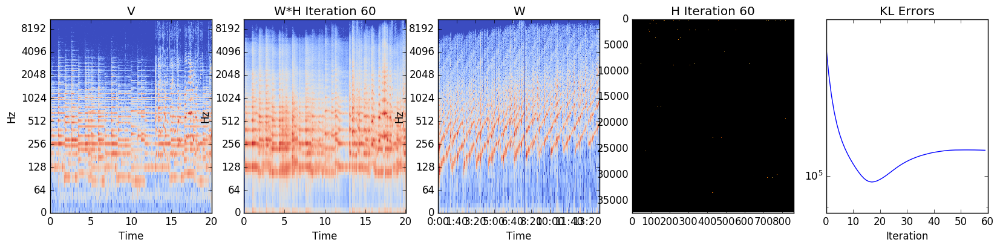

# LetItBee
A Python Implementation of Driedger's "Let It Bee" Technique for Audio Mosaicing [1], which mashes up sounds from a source file (e.g. buzzing bees) to approximate an audio file (e.g. The Beatles' "Let It Be") to create a result which sounds like the target, but with the timbre of the source (e.g. bees buzzing "Let It Be").  This uses a modified version of NMF which uses the source audio as the W matrix and the target as the V matrix, searching for V ~= WH, but with modifications so that timbral characteristics are preserved.  See  for more details.

* [1] Driedger, Jonathan, Thomas Prätzlich, and Meinard Müller. "Let it Bee-Towards NMF-Inspired Audio Mosaicing." ISMIR. 2015.

## Dependencies
* Numpy/Scipy/Matplotlib
* [librosa]
* The [Rubberband Library]

## Running
To see all options, run the script as follows
~~~~~ bash
python Musaicing.py --help
~~~~~

To obtain the buzzing bees (Bees_Buzzing.mp3) and The Beatles (Beatles_LetItBe.mp3) audio file, please visit the [supporting web site] for the original paper.  Below shows an example of how to execute the code with this example, plotting progress

~~~~~ bash
python Musaicing.py --source Bees_Buzzing.mp3 --target Beatles_LetItBe.mp3 --result result.wav --saveplots 1
~~~~~

The audio result is as follows:

Below shows a plot of the iterations and final spectrogram decomposition

Notice that the KL error does not monotonically decrease and starts to go up towards the end, but this is consistent with the choices made in [1] to preserve timbral characteristics of the source.

[ [1] ]: <https://www.audiolabs-erlangen.de/content/resources/MIR/00-2015-ISMIR-LetItBee/2015_DriedgerPM_AudioMosaicingNMF_ISMIR.pdf>
[librosa]: <http://librosa.github.io/>
[Rubberband Library]: <https://github.com/bmcfee/pyrubberband>
[supporting web site]: <https://www.audiolabs-erlangen.de/resources/MIR/2015-ISMIR-LetItBee/>
